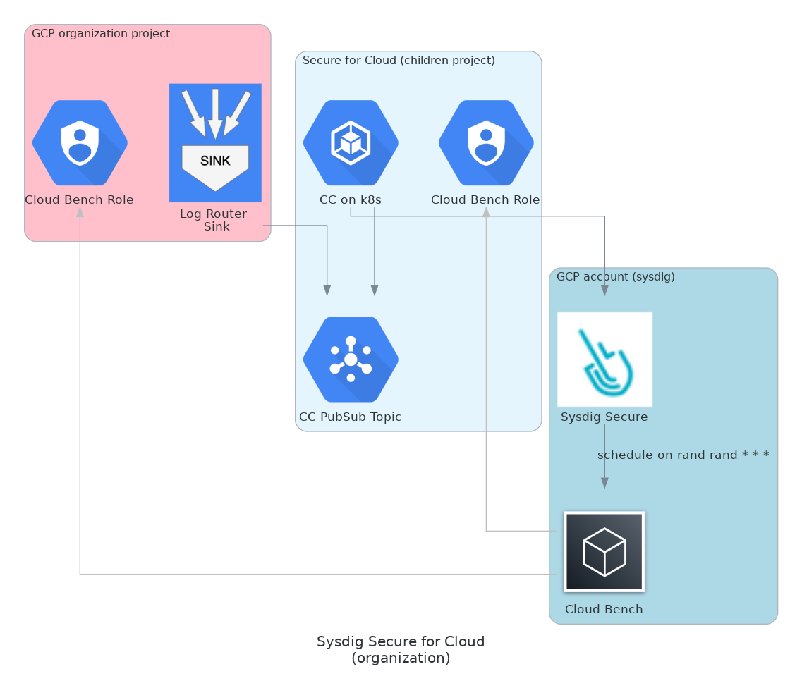

# k8s only

## Use-Case explanation

### Requirements

- Organizational setup
  - Dinamic environments
- Sysdig feats: Threat-detection, Compliance
- Customer provides all ops related tools (which don't include Terraform), so all Terraform provided stuff must be documented

## Solution

### Infra

#### Requirements

##### CC PubSub Topic + Log Router Sink (Threat)

Create a topic

Create Sink at organizational domain:
- Add as destination the pubsub
- Choose to ingest organization and child resources
- Set the following filter `logName=~"/logs/cloudaudit.googleapis.com%2Factivity$" AND -resource.type="k8s_cluster"`

Give the `Writer Identity` user from the sink `Pub/Sub Publisher` role.

<!--
##### k8s/CloudConnector(Threat) (to be hidden)

User should provide a k8s cluster to install CloudConnector on it. Both self installed and GKE are valid.
-->

##### Cloud Bench Role (Compliance)

Compliance feature needs a set of permission to run, to achieve this:

For each project:
- Create a Service Account ("sysdigcloudbench")
- Give the sysdigcloudbench Service Account the `roles/viewer` role
- Create a role ("Sysdig Cloud Benchmark Role") and assing the `storage.buckets.getIamPolicy` and `bigquery.tables.list` permissions
- Assign the "Sysdig Cloud Benchmark Role" to the sysdigcloudbench Service Account <!-- (IAM & Admin -> IAM (Edit))-->
- Create a workload identity federation pool
  - Identity pool ID must be: "sysdigcloud"
  - Provider must be AWS:
    - Provider name: "Sysdig Secure for Cloud"
    - AWS account ID: get it via curl from Sysdigs backend.
      - Run `curl -s 'https://secure.sysdig.com/api/cloud/v2/aws/trustedIdentity' --header 'Authorization: Bearer <SYSDIG_SECURE_API_TOKEN>'` replacing SYSDIG_SECURE_API_TOKEN by the API key you can find at Sysdig Secure -> Your profile -> Sysdig API Tokens -> Sysdig Secure API
      - The 12 digit number from the response is the AWS account ID you need to provide
    - Attribute mapping, set both `"google.subject" : "assertion.arn"` and `"attribute.aws_role" : "assertion.arn"`

- Set Pool Binding the role `roles/iam.workloadIdentityUser` with the member value `"principalSet://iam.googleapis.com/projects/<GOOGLE_PROJECT_NUMBER>/locations/global/workloadIdentityPools/<IDENTITY_POOL_ID>/attribute.aws_role/arn:aws:sts::<AWS_ACCOUNT_ID>:assumed-role/<AWS_ROLE_NAME>/<AWS_EXTERNAL_ID>"`
  - GOOGLE_PROJECT_NUMBER _Google Cloud -> Project number_
  - IDENTITY_POOL_ID _Identity from the pool created in the previous step_
  - AWS_ACCOUNT_ID, AWS_ROLE_NAME, AWS_EXTERNAL_ID

### How to deploy Cloud Connector (using Helm)

#### Cloud connector helm setup parms

`gcpCredentials`
`sysdig.url`
`sysdig.secureAPIToken`
`ingestors`
  - gcp-gcr-pubsub: # Receives GCP GCR from a PubSub topic
      project:
      subscription:

### How to enable a rol for Compliance
