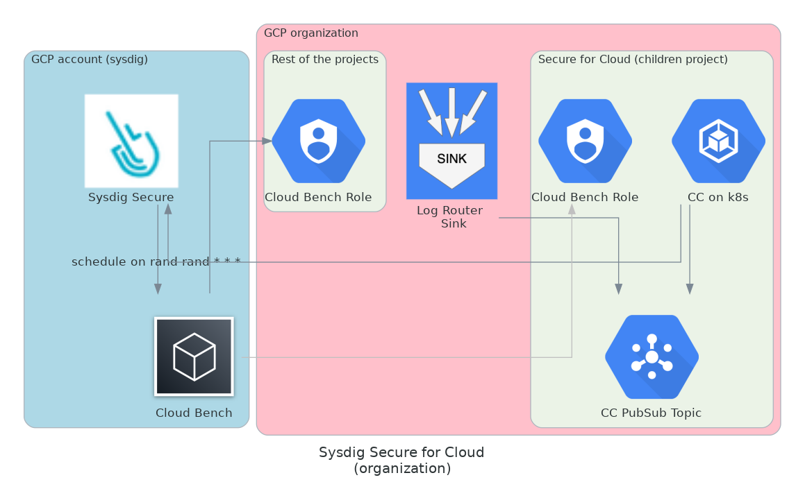
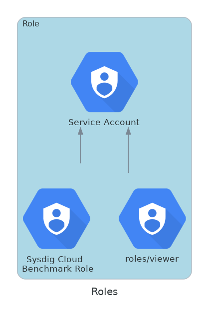

# Organizational - Kubernetes only (no TF) - Threat Detection and Compliance

## Use-Case explanation

- Organizational setup
  - Dynamic environments with projects created and destroyed on-demand
- Sysdig features: Threat-detection and Compliance for all org accounts. No image scanning
- Due to dynamic nature of customer's environment, a heavy programmatically ops tooling are used (not including Terraform) .
- A summary of the required resources/permissions will be done, so they're provisioned for the Secure for Cloud feature sto work.

## Infrastructure Solution

As a quick summary we'll need

- Organization
  - Log Router Sink
  - CloudBench Role for compliance
- Member project (Sysdig resources, existing project or new one)
  - PubSub to wire events from the log router into cloud-connector compute module
  - CloudBench Role for compliance
  - K8s cluster for cloud-connector (Sysdig compute workload for threat detection)
- Rest of member projects
  - CloudBench Role for compliance




We suggest to
- start with secure for cloud, cloud-connector module required infrastructure wiring and deployment (this will cover threat-detection side)
- then move on to Compliance role setup
<br/><br/>

### Cloud-Connector wiring: Log Router Sink + PubSub Topic

0. From your organization, **choose a member project** as `SYSDIG_PROJECT_ID`
1. In `SYSDIG_PROJECT_ID`, create a **Pub/Sub** topic (with default configuration is enough)
   - Save `SYSDIG_PUBSUB_SUBSCRIPTION_NAME` for later
2. In the organizational domain level, create **Logging Logs Router** Sink
   - Add as destination the Pub/Sub from previous point.
   - Choose to ingest organization and child resources
   - Set the following filter
    ```text
    logName=~"/logs/cloudaudit.googleapis.com%2Factivity$" AND -resource.type="k8s_cluster"
    ```
3. Give Sink **Permissions** to write on PubSub
   - Grab the `Writer Identity` user from the just created Sink
   - In the PubSub resource, grant `Pub/Sub Publisher` role to the Sink `Writer Identity`

<br/><br/>
### Secure for Cloud Compute Deployment

<!--
-- TODO. authentication howto.
- 1/first approach would be to create a SA

small explanation here https://github.com/sysdiglabs/terraform-google-secure-for-cloud/tree/master/examples/single-project-k8s
and code reference here https://github.com/sysdiglabs/terraform-google-secure-for-cloud/blob/master/examples/single-project-k8s/cloud-connector-config.tf#L21

- 2/more elegant approach to use the serviceAccount from the chart. talk with @javi
-->

1. Credentials Creation
   - This step is not really required if Kubernetes role binding is properly binded with a cloud IAM role with required permissions bellow.
   - Create Service Account with the `pubsub/subscriber` role.
   - Get the JSON credentials file for the created Service Account `<JSON_CONTENT_FROM_THE_CREDENTIALS_FILE>` (this would be an example of the content).
       ```
         {
           "type": "service_account",
           "project_id": ...
           "private_key_id": ...
           ...
         }
       ```
<br/>

2. Sysdig **Helm** [cloud-connector chart](https://charts.sysdig.com/charts/cloud-connector/) will be used with following parametrization
   - Locate your `<SYSDIG_SECURE_ENDPOINT>` and `<SYSDIG_SECURE_API_TOKEN>`. [Howto fetch ApiToken](https://docs.sysdig.com/en/docs/administration/administration-settings/user-profile-and-password/retrieve-the-sysdig-api-token/)


```yaml
rules: []
scanners: []
sysdig:
  url: <SYSDIG_SECURE_ENDPOINT>
  secureAPIToken: <SYSDIG_SECURE_API_TOKEN>

# not required but would help product
telemetryDeploymentMethod: "helm_gcp_k8s_org"

ingestors:
  # receives GCP auditlog from a PubSub topic
  - gcp-auditlog-pubsub:
      project: <SYSDIG_PROJECT_ID>
      subscription: <SYSDIG_PUBSUB_SUBSCRIPTION_NAME>

gcpCredentials: |
  <JSON_CONTENT_FROM_THE_CREDENTIALS_FILE> (beware of the tabulation)
```

Check that deployment logs throw no errors and can go to [confirm services are working](#confirm-services-are-working) for threat detection functionality checkup.
<br/>
<br/>

### Compliance - Sysdig Side

1. **Register Customer Organization Projects** on Sysdig
    - For each project you want to provision for the Compliance feature, we need to register them on Sysdig Secure
    - For Sysdig Secure backend API communication [How to use development tools](https://docs.sysdig.com/en/docs/developer-tools/). Also we have this [AWS provisioning script](https://github.com/sysdiglabs/aws-templates-secure-for-cloud/blob/main/utils/sysdig_cloud_compliance_provisioning.sh) as reference, but we will explain it here too.
    ```shell
    curl "https://<SYSDIG_SECURE_ENDPOINT>/api/cloud/v2/accounts?upsert=true" \
    --header "Authorization: Bearer <SYSDIG_SECURE_API_TOKEN>" \
    -X POST \
    -H 'Accept: application/json' \
    -H 'Content-Type: application/json' \
    -d '{
       "accountId": "<GCP_PROJECT_NUMBER>",
       "alias": "<GCP_PROJECT_ID>",
       "provider": "gcp",
       "roleAvailable": true,
       "roleName": "sysdigcloudbench"
    }'
    ```

<br/>
<br/>

2. Register **Benchmark Task**
    - Create a single task to scope the organization group ids to be assessed.
    - This script does not cover it, but specific regions can be scoped too. Check `Benchmarks-V2` REST-API for more detail
   ```shell
    $ curl -s "https://<SYSDIG_SECURE_ENDPOINT>/api/benchmarks/v2/tasks" \
    --header "Authorization: Bearer <SYSDIG_SECURE_API_TOKEN>" \
    -X POST \
    -H 'Accept: application/json' \
    -H 'Content-Type: application/json' \
    -d '{
    "name": "Sysdig Secure for Cloud (GCP) - Organization",
    "schedule": "0 3 * * *",
    "schema": "gcp_foundations_bench-1.2.0",
    "scope": "gcp.projectId in ('<GCP_PROJECT_ID1>',...,'<GCP_PROJECT_IDN>')'",
    "enabled": true
    }'
    ```

<br/>
<br/>

3. Get **Sysdig Federation Trusted Identity**
   - For later usage, fetch the Trusted Identity, which is composed by the parts `SYSDIG_AWS_ACCOUNT_ID` and `SYSDIG_AWS_ROLE_NAME`
    ```shell
    $ curl -s 'https://<SYSDIG_SECURE_ENDPOINT>/api/cloud/v2/gcp/trustedIdentity' \
    --header 'Authorization: Bearer <SYSDIG_SECURE_API_TOKEN>'
    ```
    Response pattern:
    ```shell
    arn:aws:iam::SYSDIG_AWS_ACCOUNT_ID:role/SYSDIG_AWS_ROLE_NAME
    ```
   <br/><br/>
4. Get **Sysdig ExternalId**
    - For later usage, fetch `SYSDIG_AWS_EXTERNAL_ID` from one of the previously registered GCP projects. All accounts will have same id (you only need to run it once).
    ```shell
    $ curl -s "https://<SYSDIG_SECURE_ENDPOINT>/api/cloud/v2/accounts/<GCP_PROJECT_ID>?includeExternalId=true" \
    --header "Authorization: Bearer $SYSDIG_API_TOKEN"
    ```
    From the resulting payload get the `externalId` attribute value.

   <br/><br/>

### Compliance - Customer's Side

We'll need, **for each project** (`GCP_PROJECT_NUMBER`)

- A **Service Account** (SA) with `IAM Workload Identity Federation` that provides access to Sysdig's AWS Cloud infrastructure, to be able to assess your infrastructure Compliance
    - currently, federation is only available through AWS, but we will enable other clouds in the near-future
- **Permissions** set to the SA to be able to read customer's infrastructure




1. Create a **Custom Role** (ex.: 'Sysdig Cloud Benchmark Role') and assign to it following permissions
   - `storage.buckets.getIamPolicy`
   - `bigquery.tables.list`
   - `cloudasset.assets.listIamPolicy`
   - `cloudasset.assets.listResource`
   - this is required to add some more permissions that are not available in GCP builtin viewer role
2. Create a **Service Account** with the name 'sysdigcloudbench'
   - This role must match the `roleName` set when the project was registered with Sydig in step 1 of Compliance - Sysdig Side
   - Give it GCP builtin `roles/viewer` **Viewer Role**
   - And previously created Custom Role <!-- tip: in UI: IAM & Admin -> IAM (Edit)-->

3. Create a **Workload Identity Federation Provider and Pool**
   - Provider must be created for `aws` provider, using the `SYSDIG_AWS_ACCOUNT_ID`
   - Create a pool as with name 'sysdigcloud' `<IDENTITY_POOL_ID>`
   - Provider must be AWS:
     - Provider name: "Sysdig Secure for Cloud"
     - Attribute mapping, set both
     ```text
     google.subject: assertion.arn
     attribute.aws_role: assertion.arn
     ```

4. In the previously created 'sysdigcloudbench' SA, we need to create a **Service Account Pool Binding**
   - Set Pool Binding the role `roles/iam.workloadIdentityUser`
   - For the members value, we will add the following
     > principalSet://iam.googleapis.com/projects/<GCP_PROJECT_NUMBER>/locations/global/workloadIdentityPools/<IDENTITY_POOL_ID>/attribute.aws_role/arn:aws:sts::<SYSDIG_AWS_ACCOUNT_ID>:assumed-role/<SYSDIG_AWS_ROLE_NAME>/<SYSDIG_AWS_EXTERNAL_ID>

## Confirm services are working

- [Official Docs Check Guide](https://docs.sysdig.com/en/docs/installation/sysdig-secure-for-cloud/deploy-sysdig-secure-for-cloud-on-gcp/#confirm-the-services-are-working)
- [Forcing events](https://github.com/sysdiglabs/terraform-google-secure-for-cloud#forcing-events)
